# NavDeck 使用手册

> 自托管 Docker 导航站，为 NAS 玩家而生。卡片化管理你的所有自托管服务，一眼掌握 NAS 状态。

---

## 01 认识 NavDeck

NavDeck 是一个部署在你自己 NAS 上的**导航起始页**。把 qBittorrent、Jellyfin、Alist 这些自托管服务做成一张张卡片，配合实时 Docker 状态监控和智能内外网地址切换，点一下就能到达正确的地方。

| 功能 | 说明 |
|------|------|
| 卡片化导航 | 分类组织 + 拖拽排序 + 批量管理，服务再多也井井有条 |
| Widget 栏 | NAS 状态、资源水位、倒数日 / 正数日，实例化自由组合 |
| 内外网自动切换 | 在家走内网，在外走公网，点击卡片永远跳对地址 |
| Lucky 规则同步 | 一键把 Lucky 反代规则同步成卡片，不再手动维护 |
| 拼音全局搜索 | `⌘/Ctrl + K` 唤起，支持拼音和首字母缩写匹配 |
| 备份 / 恢复 | 一键导出 zip，配置和上传文件完整带走 |

## 02 快速上手

### 登录

首次使用请查看 `.env` 中的默认账号（`admin / changeme`），登录后请立即前往「设置 → 通用」修改密码。

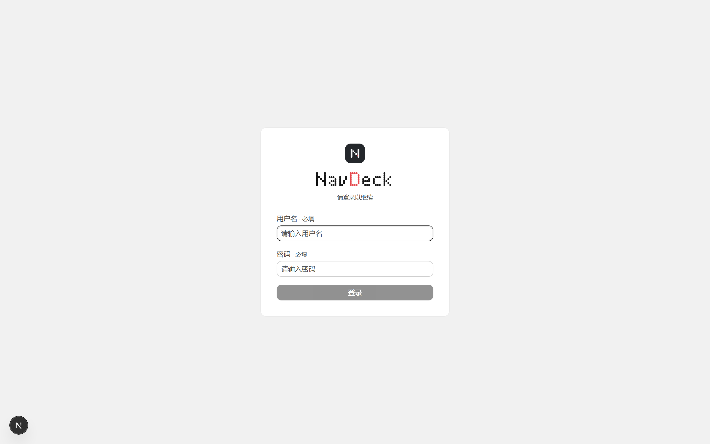

### 基本操作速查

| 操作 | 效果 |
|------|------|
| `⌘/Ctrl + K` | 全局搜索卡片 |
| 顶部搜索框 | 输入任意关键词回车，直接跳转当前选中的搜索引擎 |
| 右上工具栏「编辑」按钮 | 进入编辑模式，可拖拽卡片 / 分类，二次点击进入批量删除 |
| 右上工具栏「主题」按钮 | 明暗主题切换 |
| Widget 栏 ＋ 按钮 | 添加新的 Widget 实例 |

## 03 主页总览

主页自上而下分为四个区域：**品牌与时间**、**全局搜索框**、**Widget 栏**和**分类卡片区**。Widget 栏横贯首屏，网格按宽度自动 4 列 / 2 列切换。

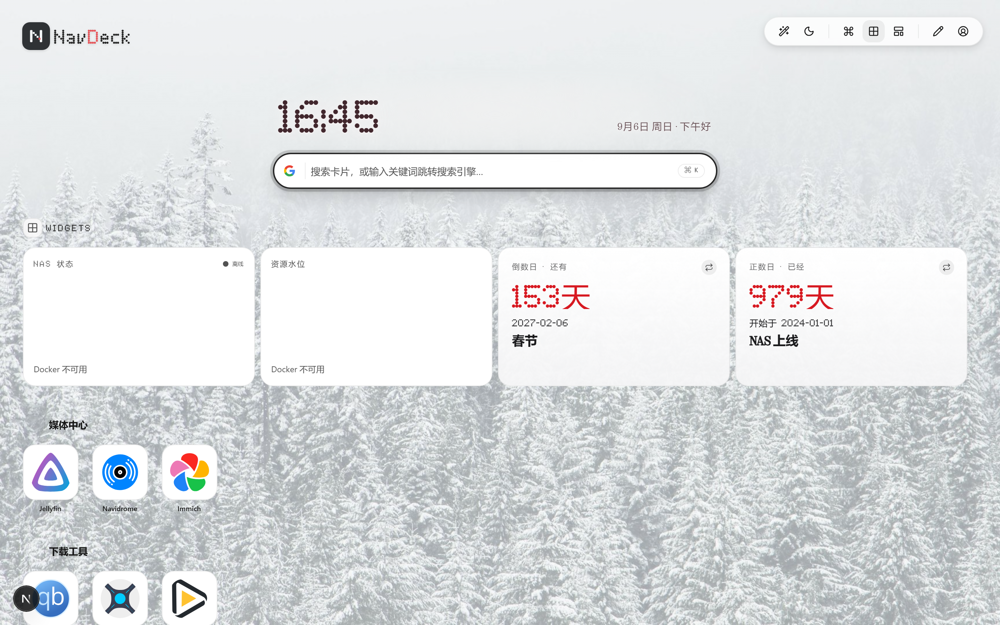

## 04 卡片与分类

### 添加卡片

点击分类标题旁的 **＋** 新建卡片，填写名称与地址即可。图标有三种来源：

1. **自动抓取 favicon** —— 填完地址自动尝试获取网站图标
2. **内置图标库** —— 275+ 精选自托管服务图标，支持搜索
3. **本地上传** —— 上传自定义图片

### 拖入链接快速创建

把浏览器地址栏的 URL、书签或网页中的链接直接拖到 NavDeck 页面上，会出现「松开以添加卡片」的放置提示；松手后自动打开新建卡片弹框并**预填地址**，补上名称、选好分类保存即可。

- 仅识别 http/https 链接
- 拖入文件（如图标上传）不受影响
- 与编辑模式下的卡片排序拖拽互不干扰

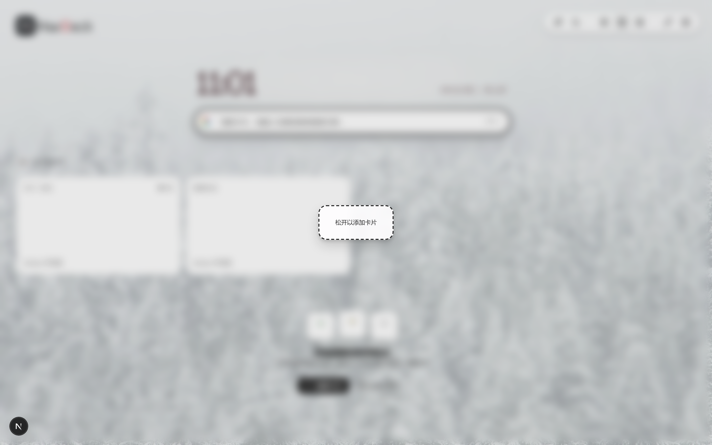

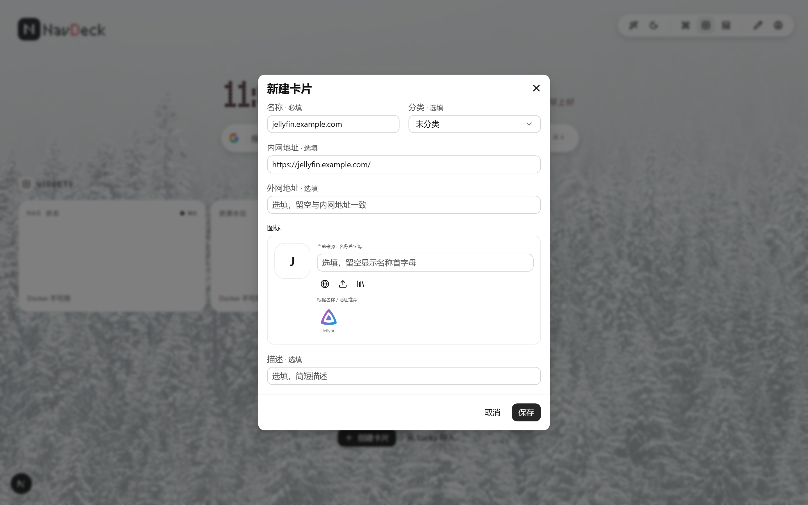

### 卡片地址与内外网

每张卡片可以同时配置**内网地址**和**外网地址**。网络策略设为「自动」时，NavDeck 会探测哪个地址可达并优先跳转；也可以在「设置 → 通用」固定为内网或外网模式。

### 分类管理

「设置 → 分类」中可以新建、重命名、拖拽排序分类，删除分类时其中的卡片会自动移入「未分类」。

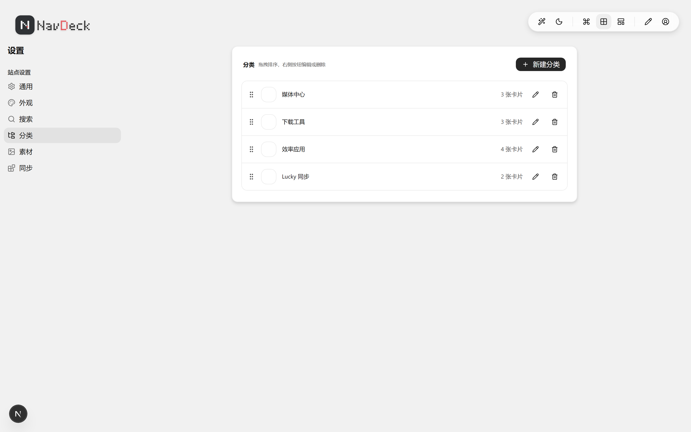

### 空状态

还没有任何卡片时，主页会显示空状态引导——「开始搭建你的导航台」，提供两个入口：

- **创建卡片**：打开新建卡片弹框，新卡片默认归入「未分类」
- **从 Lucky 导入**：跳转「设置 → 同步」，启用 Lucky 规则一键同步

添加第一张卡片后，空状态会自动消失。

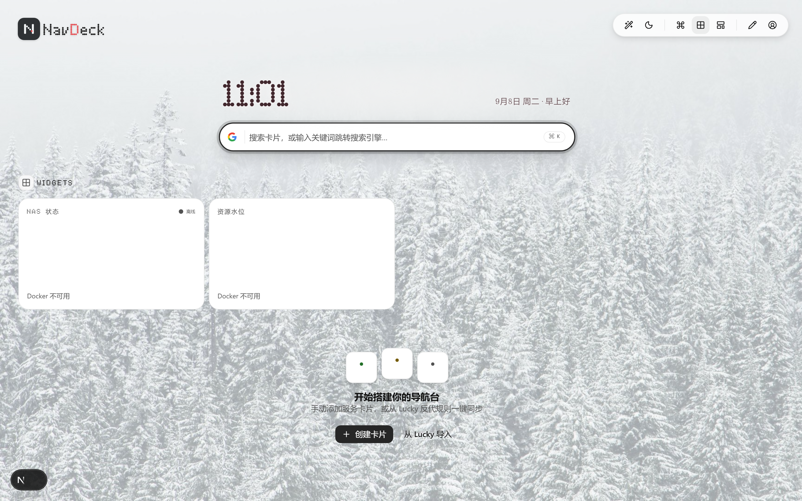

## 05 全局搜索

按 `⌘/Ctrl + K` 唤起全局搜索。匹配规则覆盖**名称子串、全拼和拼音首字母缩写**——输入「jlc」也能找到「Jellyfin」。

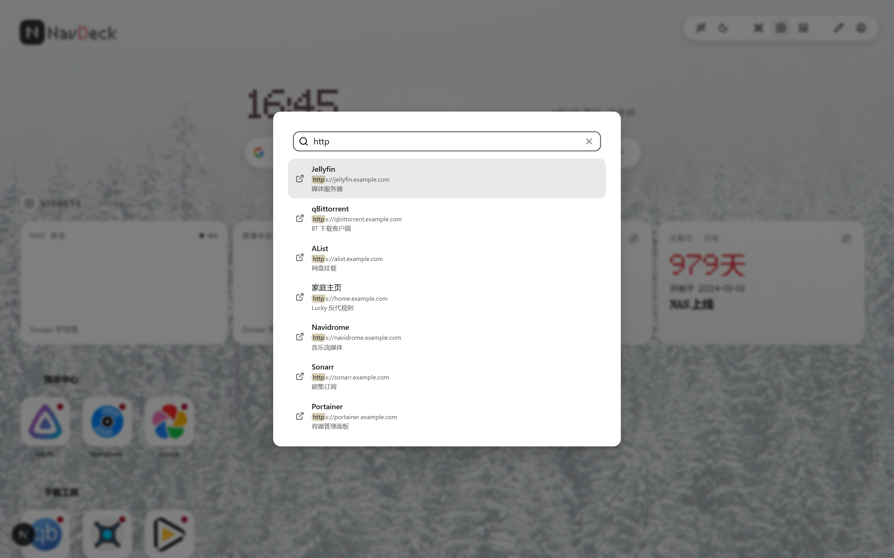

顶部搜索框则是**搜索引擎跳转入口**：输入非卡片关键词回车，直接用当前选中的引擎搜索。引擎可以在「设置 → 搜索」中增删改和排序。

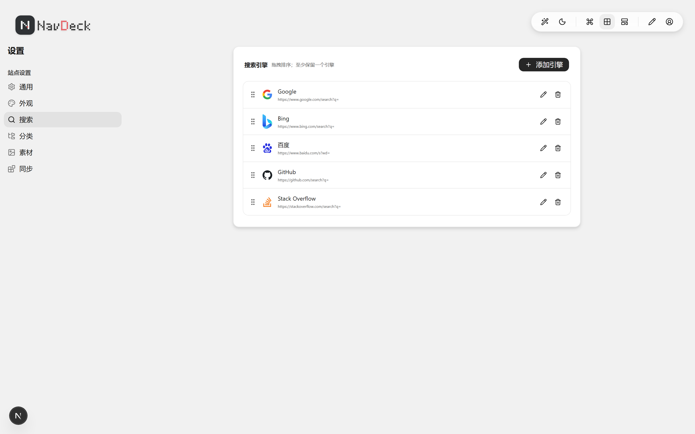

## 06 Widget 小组件

Widget 栏支持 4 种小组件，**同类可重复添加、每个实例独立配置**，支持调整大小和拖拽排序：

| Widget | 说明 |
|--------|------|
| NAS 状态 | Docker 容器运行状态总览（在线 / 停止 / 总数） |
| 资源水位 | CPU / 内存 / 磁盘 IO 实时水位，30 秒自动刷新 |
| 倒数日 | 距离未来的重要日子还有几天，支持多日期项与每月重复 |
| 正数日 | 过去的重要日子已经过去了多少天 |

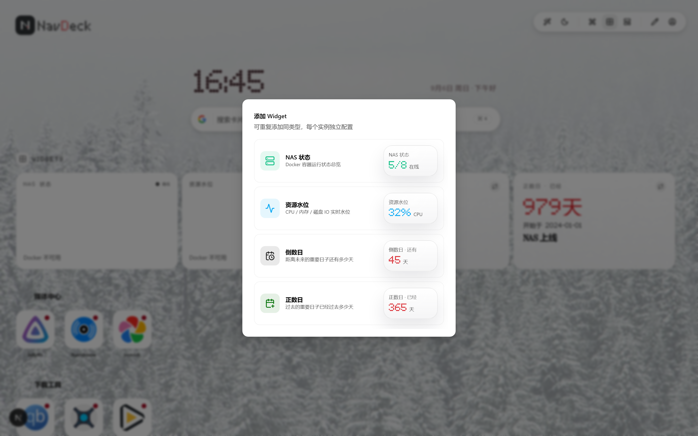

> Docker 数据通过挂载的 `docker.sock`（或 `DOCKER_HOST`）获取；不可用时 Widget 会降级显示，不影响其他功能。

## 07 Lucky 规则同步

如果你在用 [Lucky](https://lucky666.cn) 做反向代理，NavDeck 可以直接读取它的 Web 服务规则，一键同步成卡片：

1. 在 Lucky 后台「设置」页最底部获取 **OpenToken**
2. 打开「设置 → 同步」，启用 Lucky 同步，填入后台地址与 OpenToken
3. 点击「立即同步」—— 反代规则的前端域名 → 外网地址，后端地址 → 内网地址，自动建卡

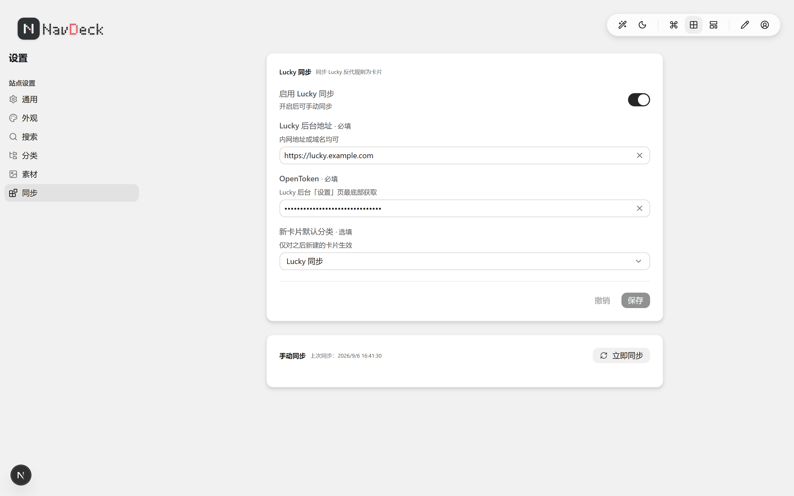

同步是**全量 diff**：Lucky 侧删除或禁用的规则，对应卡片只标记失效，不会立刻删除——你可以在同步页一键恢复跳过的规则，或彻底清理。

## 08 外观与壁纸

「设置 → 外观」提供明暗主题（亮色 / 暗色 / 跟随系统）、界面字体大小、卡片状态灯开关，以及自定义首页壁纸。

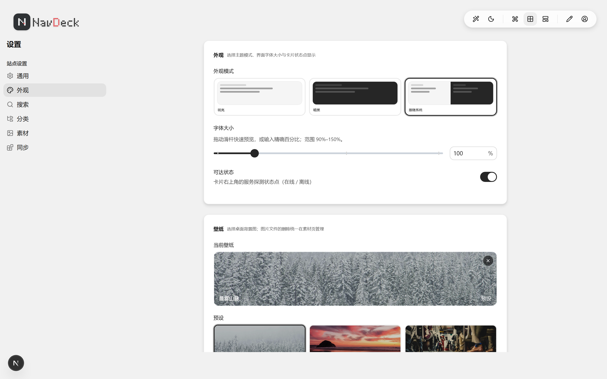


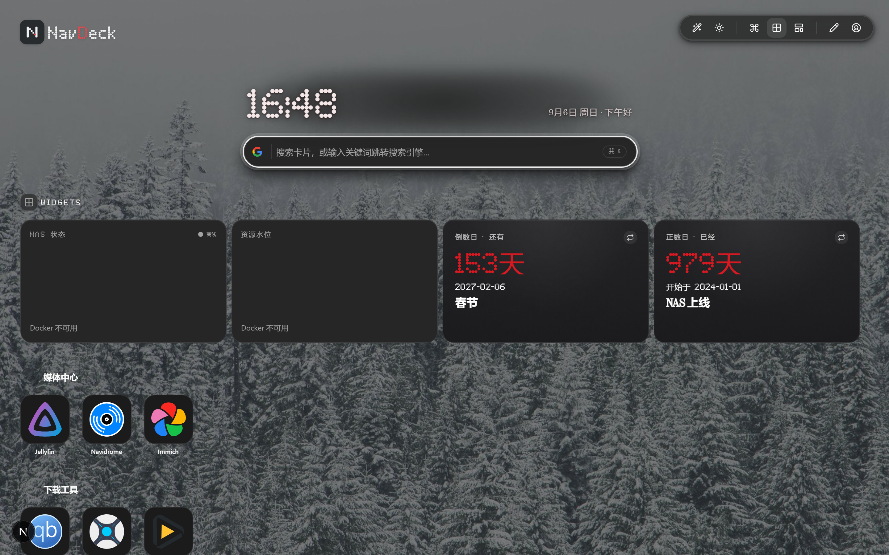

上传过的图标与壁纸统一在「设置 → 素材」中管理，可查看引用情况并安全清理。

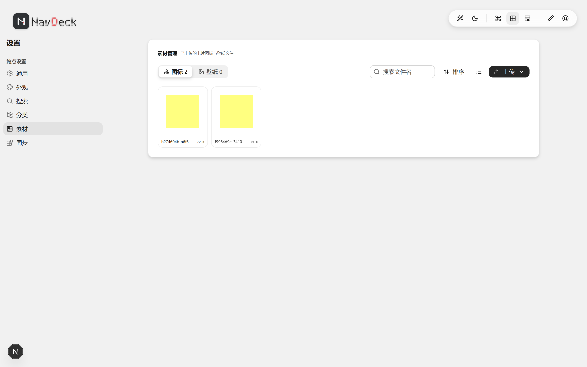

## 09 站点设置

「设置 → 通用」集中管理站点级配置：

- **品牌** —— 自定义站点标题与 Logo
- **账号 / 安全** —— 修改用户名与密码（首次登录后务必改密）
- **网络** —— 网络策略：自动探测 / 固定内网 / 固定外网

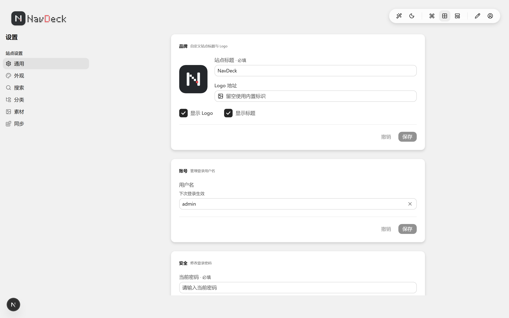

## 10 备份与恢复

「设置 → 通用 → 备份」：

- **导出** —— 下载 zip 包，包含全部配置数据 + 上传的图标 / 壁纸文件
- **导入** —— 支持上传 zip 或裸 JSON，恢复到任意 NavDeck 实例

> 建议在修改大量配置或迁移 NAS 前先导出一份备份。

## 11 部署

推荐使用 Docker Compose 一键部署（详见仓库根目录 [README](../README.md)）：

```bash
docker compose up -d --build
```

容器启动时自动执行数据库迁移与种子写入，数据持久化在 `./data` 目录。Docker 监控需挂载 `/var/run/docker.sock`。

## 12 开源致谢

NavDeck 站在众多优秀开源项目的肩膀上，感谢这些项目（排名不分先后）：

| 项目 | 用途 |
|------|------|
| [Next.js](https://nextjs.org) | 全栈框架（App Router + Turbopack） |
| [React](https://react.dev) / [TypeScript](https://www.typescriptlang.org) | UI 与类型系统 |
| [Astryx](https://github.com/facebook/astryx) | UI 组件库与设计系统（neutral 主题） |
| [Tailwind CSS](https://tailwindcss.com) | 原子化样式 |
| [Prisma](https://www.prisma.io) + [libsql](https://turso.tech/libsql) | 数据库 ORM 与 SQLite 驱动 |
| [Auth.js (NextAuth v5)](https://authjs.dev) + [bcrypt.js](https://github.com/dcodeIO/bcrypt.js) | 认证与密码哈希 |
| [dnd-kit](https://dndkit.com) | 卡片 / 分类 / Widget 拖拽排序 |
| [React Hook Form](https://react-hook-form.com) + [Zod](https://zod.dev) | 表单与数据校验 |
| [pinyin-pro](https://github.com/zh-lx/pinyin-pro) | 拼音 / 首字母搜索匹配 |
| [dockerode](https://github.com/apocas/dockerode) | Docker 容器状态与资源监控 |
| [cheerio](https://github.com/cheeriojs/cheerio) | favicon 抓取解析 |
| [Lucide](https://lucide.dev) | 界面图标 |
| [dashboard-icons (homarr-labs)](https://github.com/homarr-labs/dashboard-icons) | 275+ 内置自托管服务图标 |
| [Lucky](https://lucky666.cn) | 反代规则 OpenAPI 同步数据源 |
| [SWR](https://swr.vercel.app) / [date-fns](https://github.com/date-fns/date-fns) / [adm-zip](https://github.com/cthackers/adm-zip) | 数据请求 / 日期处理 / 备份打包 |
| [Vitest](https://vitest.dev) / [Playwright](https://playwright.dev) | 单元测试与端到端测试 |
| [Biome](https://biomejs.dev) / [Husky](https://typicode.github.io/husky) / [commitlint](https://commitlint.js.org) | 代码质量与提交规范 |

**特别感谢** homarr-labs 的 dashboard-icons 项目为内置图标库提供数据源，以及 Lucky 项目的 OpenAPI 让导航站与反代规则无缝联动。

Widget 视觉设计参考了多款优秀作品：NaviDash 的卡片阴影配方与入场动画、Nothing OS 日期小组件的排版、Days Matter 的倒数日详情页、KWGT 的品牌像素强调色——感谢这些设计带来的灵感。

NavDeck 基于 [MIT License](../LICENSE) 开源，欢迎 Star、Issue 与 PR。
